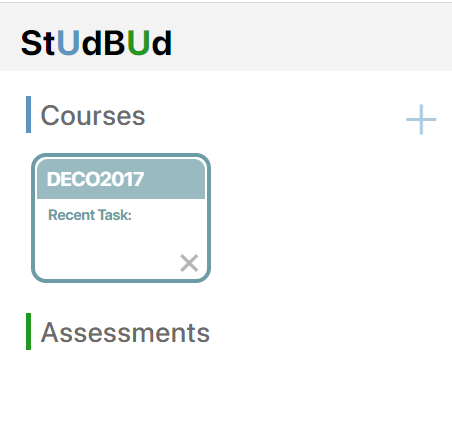
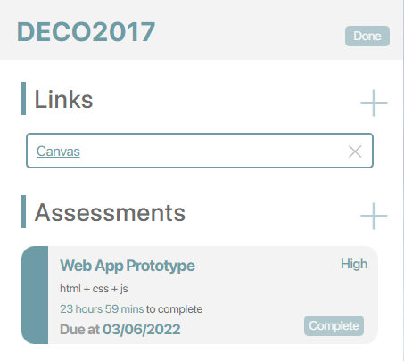
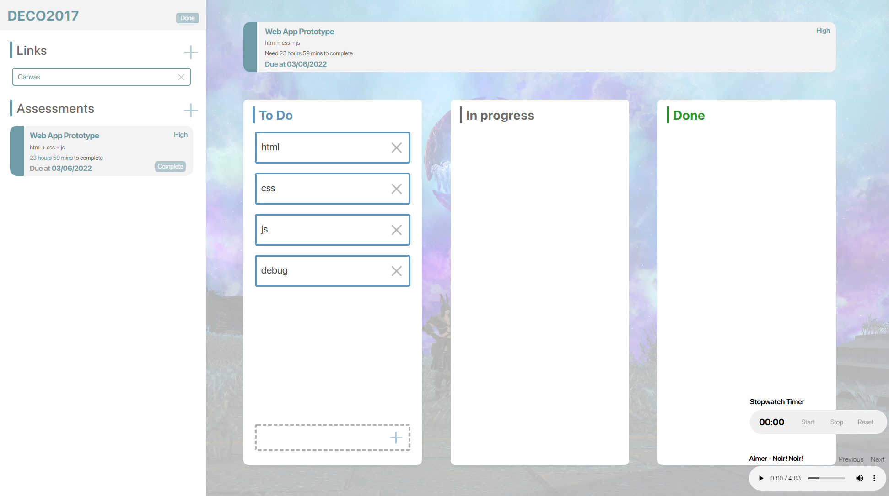

Original repositories: (unfortunately broken)

https://github.com/EricaNoir/studbud

# What is a StUdBUd?
>StUdBUd is an app aiming to help university students planning their time on assessments.

# What's the features of StUdBUd?
  * __Add your courses__, you can add your course with name, code and description first.
  
  
  * __Add links and assessments to each courses__, with course created, just click into it and you can see two add buttons, which allow you to add a link or an assessment. 
  

  * __Edit kanban board with every assessment__, after creating one assessment, you can visit it and see a kanban board, just add and drag tasks in it.
  

  * __Music player__, you can play some music with music player in the bottom right corner.
  * __Stopwatch timer__, you can use stop watch timer which is above the music player.

# Reference 
STOPWATCH | Cloudflare. (n.d.). 
    Retrieved from https://codepen.io/cathydutton/pen/xxpOOw

Pie, T. (2022, March 30). How to Build a Todo List App With Javascript and Local Storage. 
    Retrieved from https://thecodingpie.medium.com/how-to-build-a-todo-list-app-with-javascript-and-local-storage-a884f4ea3ec

kanban board with html, css and js | Cloudflare. (n.d.-b). 
    Retrieved from https://codepen.io/karthikdevarticles/pen/PopxPwO